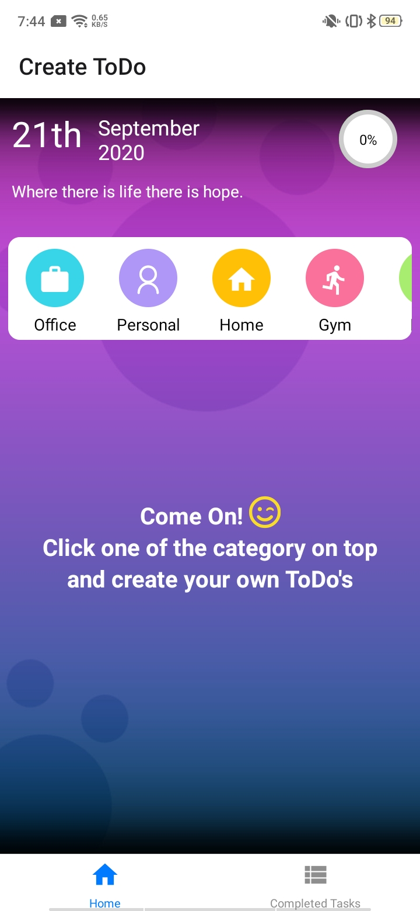
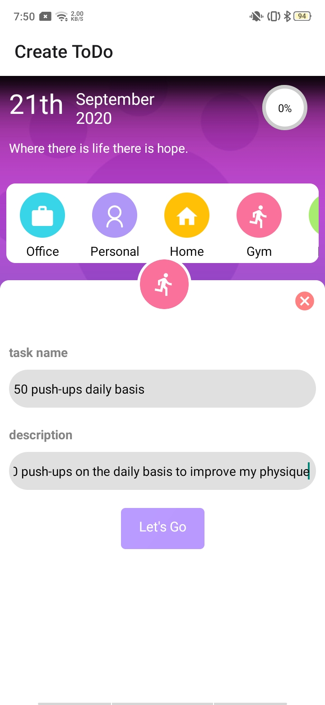
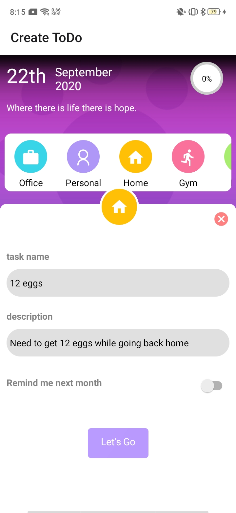
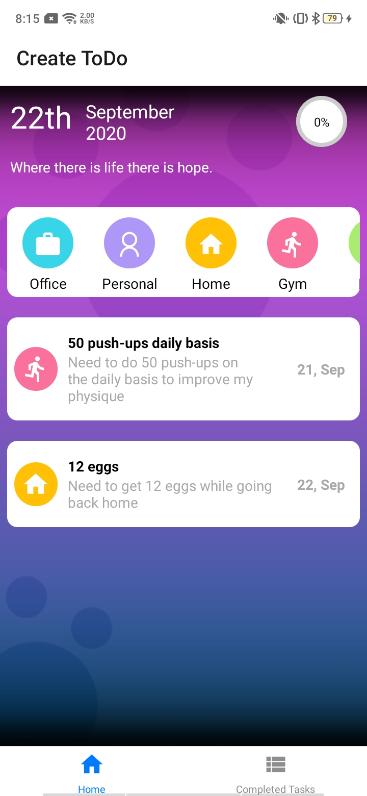
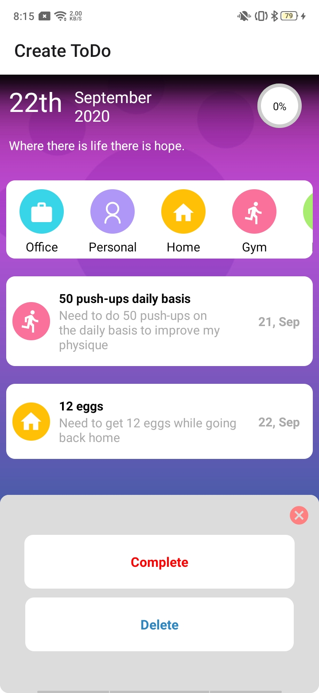
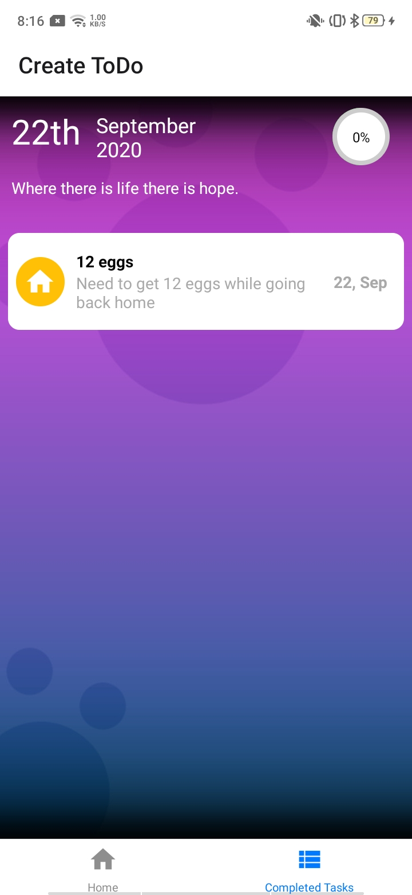

## ToDo Application

 > Its a React Native Application where a user can create ToDo's for different categories and can update those tasks either by completing or deleting them. 

- To start a Development server run  `expo start`

